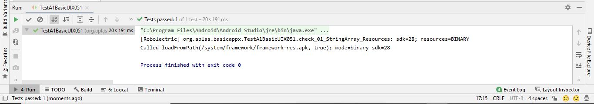

# 02 - Layout

## Tujuan Pembelajaran

Topik ini berisi beberapa materi pelajaran termasuk properti proyek, desain tata letak menggunakan XML dan definisi serta pengelolaan sumber daya seperti drawable, warna, string, dan gaya. Ini adalah langkah penting dalam mempelajari Android, di mana pengguna akan mulai membuat aplikasi Android dengan mendesain antarmuka dengan XML.

## Hasil Praktikum

TestA1BasicUIX011

TestA1BasicUIX021

TestA1BasicUIX031

TestA1BasicUIX041

TestA1BasicUIX051

TestA1BasicUIX052

TestA1BasicUIX061

TestA1BasicUIX071

TestA1BasicUIX081

TestA1BasicUIX082

TestA1BasicUIX091

TestA1BasicUIX092

