# 03 - Basic Activity

## Tujuan Pembelajaran

1. Students create a Temperature, Distance and Weight class to convert unit
2. Students create a new image element and fill it when formula checkbox
checked
3. Students can make fields and methods in main activity class.
4. Students understand about RadioGroup changed event and how to
change Spinner content.
5. Make some events action for Button, Spinner, and CheckBox
6. Students create a method to do conversion

## Hasil Praktikum

TestB1BasicUIX011
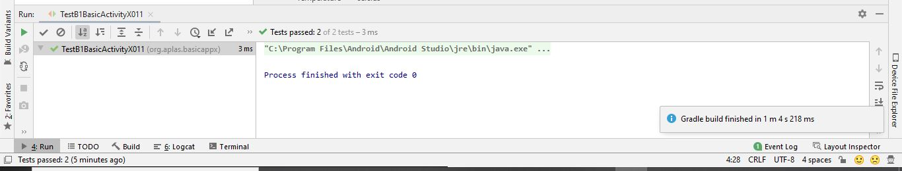

TestB1BasicUIX021
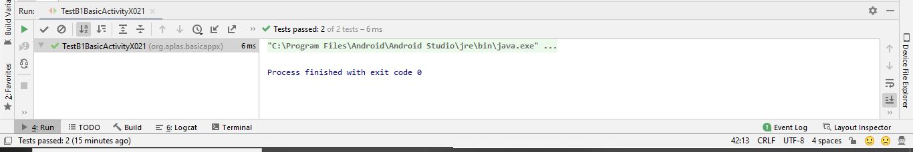

TestB1BasicUIX031
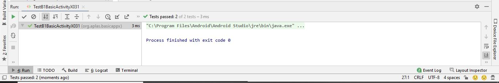

TestB1BasicUIX041
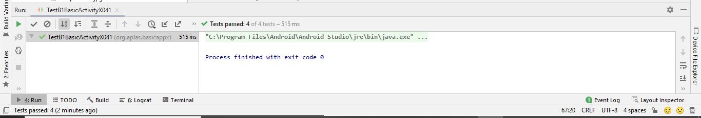

TestB1BasicUIX051
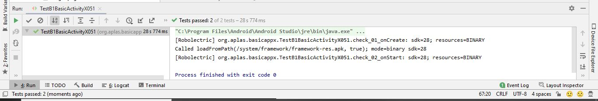

TestB1BasicUIX061
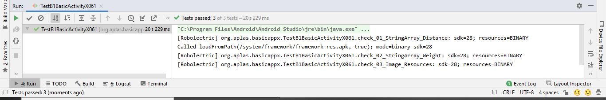

TestB1BasicUIX062
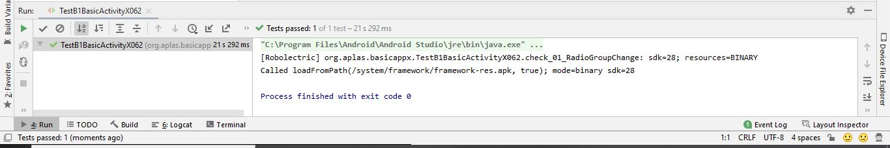

TestB1BasicUIX071
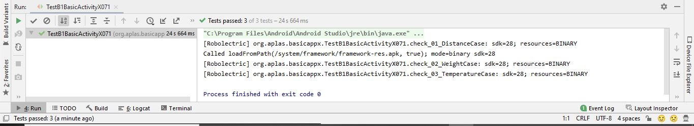

TestB1BasicUIX081
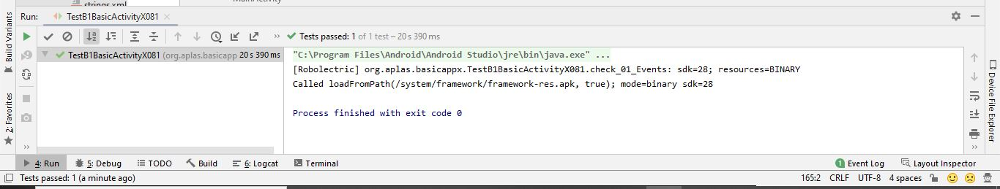

TestB1BasicUIX091
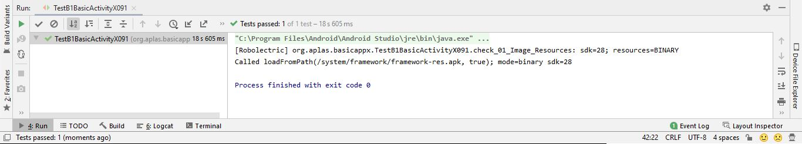

TestB1BasicUIX092
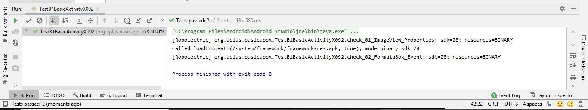

Output :
Unit Converter
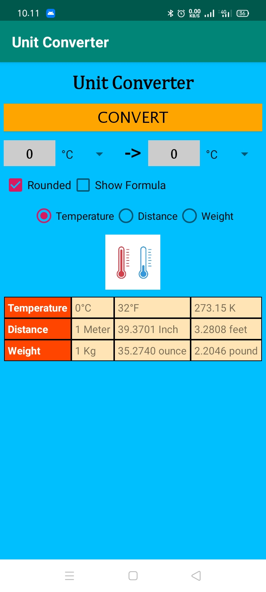
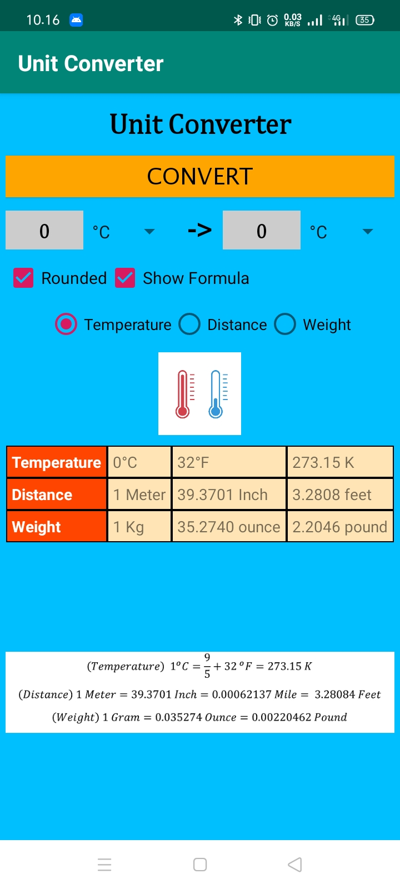

Convert Distance
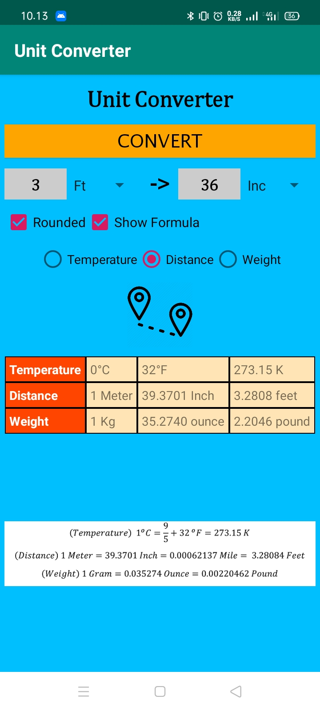

Convert Temperature
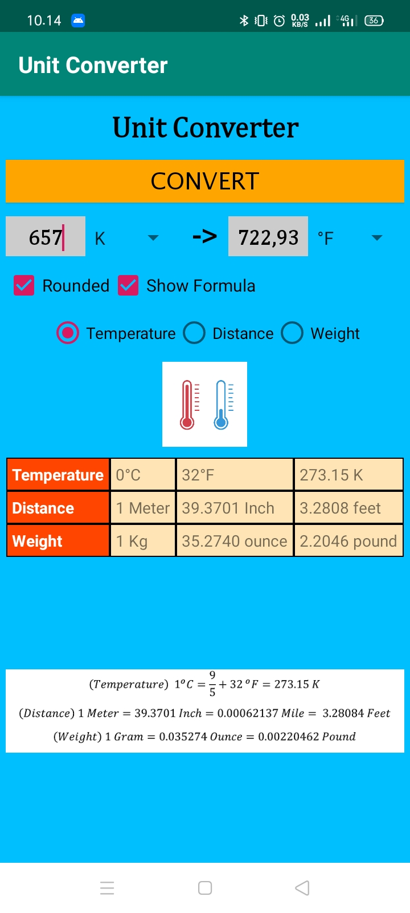

Convert Weight

List
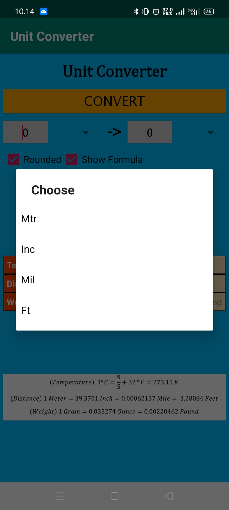
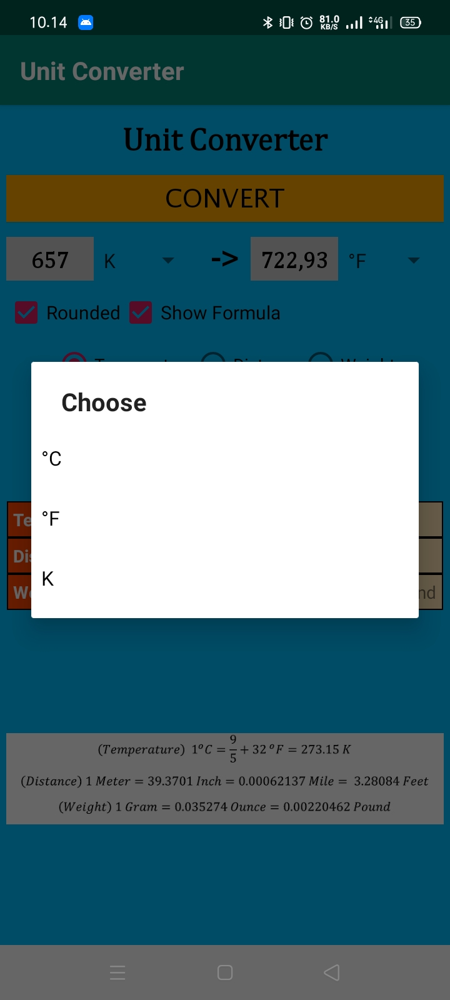
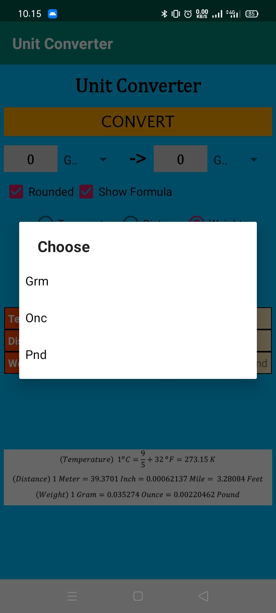
