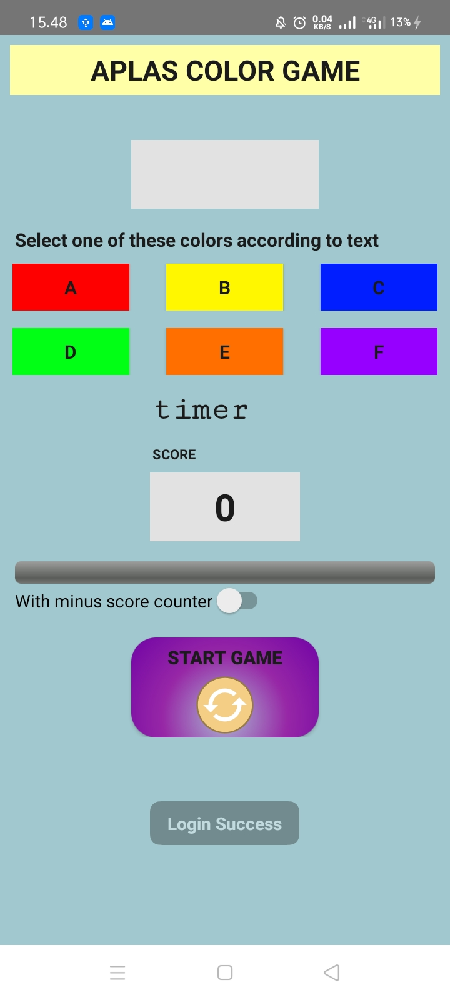

# 04 - Advanced Widget

## Tujuan Pembelajaran

1. Student will start the project to create simple game Android application.
First with project configuration and resource configuration
2. Student will understand about style, theme, and drawable vector image
3. Student will make the UI for project of Color Game with some onClick attribute
4. Student will understand how Countdowntimer works.
change Spinner content.
5. Student will declare fields needed by application and define method to check validity to enter the game.
6. Student will understand how access array from resource and put it into List and Hashtable.
7. Student will understand how start the timer to start the game.
8. Student will understand how to handle timer and calculate the score

## Hasil Praktikum

TestB2BasicUIX011

TestB1BasicUIX012

TestB1BasicUIX021

TestB1BasicUIX031

TestB1BasicUIX041

TestB1BasicUIX051

TestB1BasicUIX061

TestB1BasicUIX071

TestB1BasicUIX081

ColorGameX

Login Success

Login Failed

Tampilan ColorGameX

Final Score

