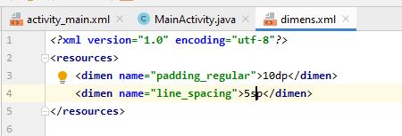
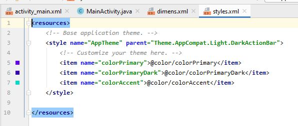
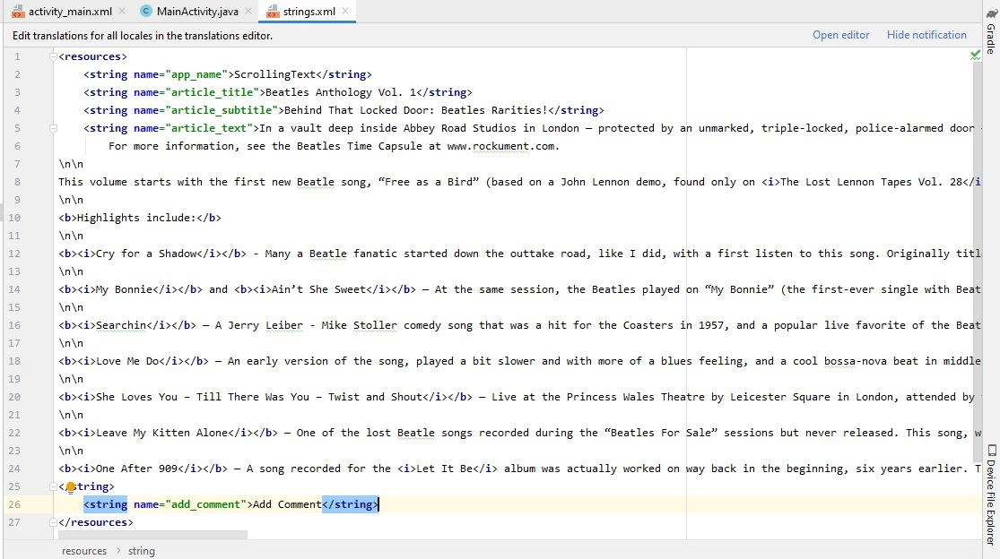
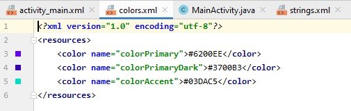
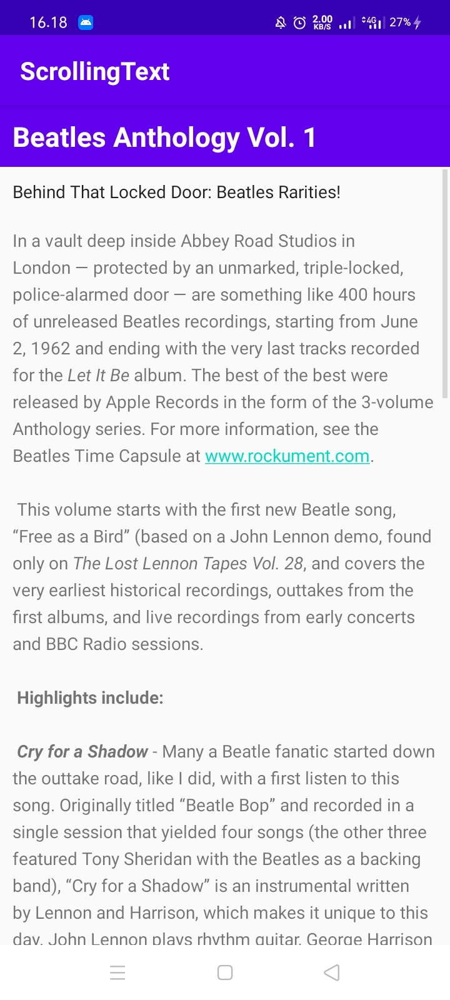
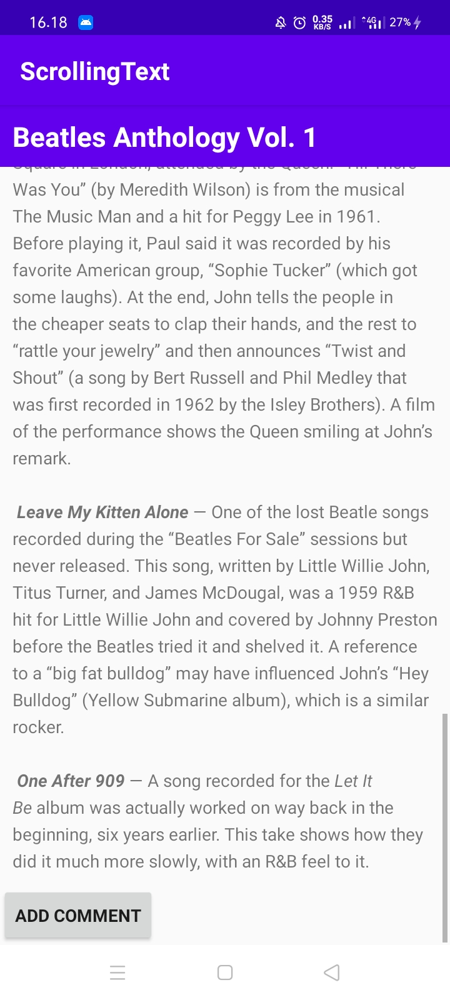

# 05 - Android fundamentals 01.3: Text and scrolling views

## Tujuan Pembelajaran

1. How to use XML code to add multiple TextView elements.
2. How to use XML code to define a scrolling View.
3. How to display free-form text with some HTML formatting tags.
4. How to style the TextView background color and text color.
5. How to include a web link in the text.

## Hasil Praktikum

activity_main.xml

Values - dimens.xml

Values - styles.xml

Values - strings.xml

Values - color.xml

ScrollingText

ScrollingText Button "Add Comment"

