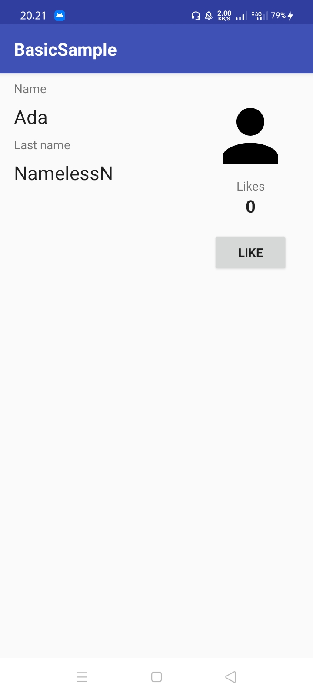
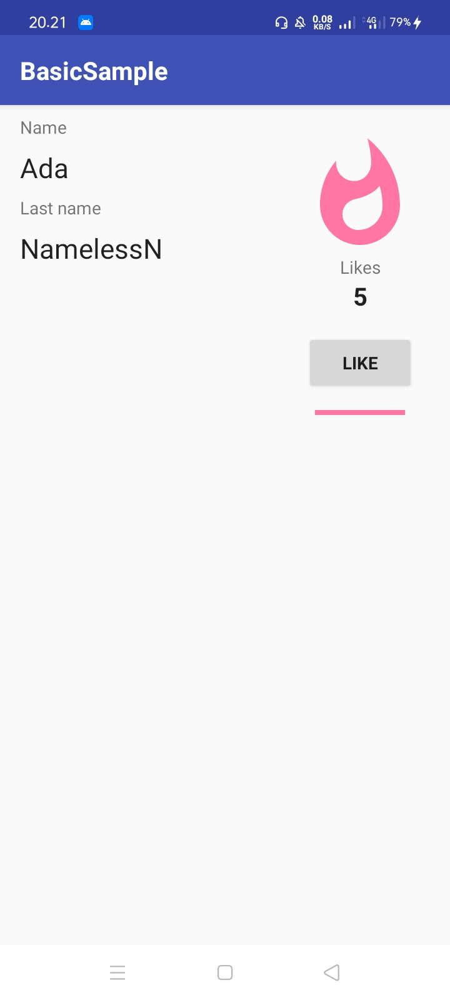
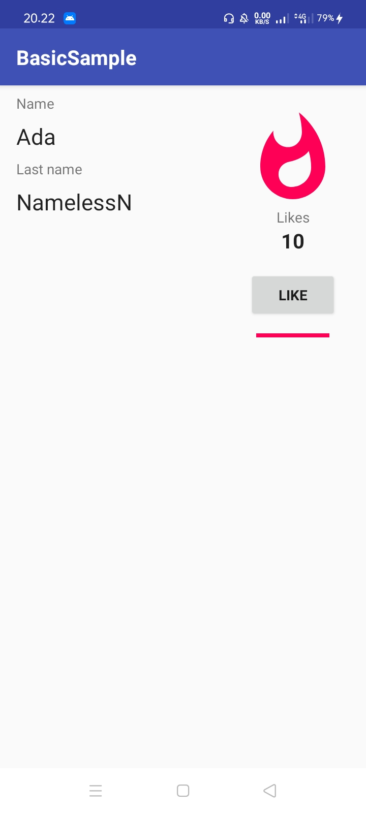

# 07 - Data Binding in Android

The Data Binding Library is an Android Jetpack library that allows you to bind UI components in your XML layouts to data sources in your app using a declarative format rather than programmatically, reducing boilerplate code.

## Hasil Praktikum

Data Binding

5 Likes

10 Likes

