# 08 - Soccer Match (B3-Aplas)

## Tujuan Pembelajaran

1. How to to design the Log layout as third layout that contains
TextView, RecyclerView, and Button
2. How to create an Android application that contains several activities entitled Soccer Match. First with project configuration and resource configuration.
3. How to start programing for PlayActivity. This task will introduce:
- how to gather Intent passing variables,
- how to use Timer with Handler,
- how to use Popup Menu, and
- how to create and access Fragment.
4. How to design the Play layout as second layout that contains
CardView, ImageButton, ImageView, TextView, Fragment Container, and Button
5. How to start programing for MainActivity. This task will introduce how to handle ListView, open image selector intent show a dialog, and go to another intent.
6. How to design the layout of list, layout of dialog, layout of
match log, and layout of footer fragment.
7. How to programing for LogActivity. This task will introduce:
- how to gather Intent passing variables,
- how to use RecyclerView,
- how to use View adapter, and
- how to load array as Intent’s extra.
8. How to design the Main layout as first layout that contains
CardView, ListView, ImageButton, TextView, EditText, and Button

## Hasil Praktikum

Test 
TestB3MultiActivities011
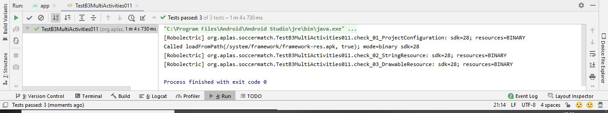

TestB3MultiActivities021
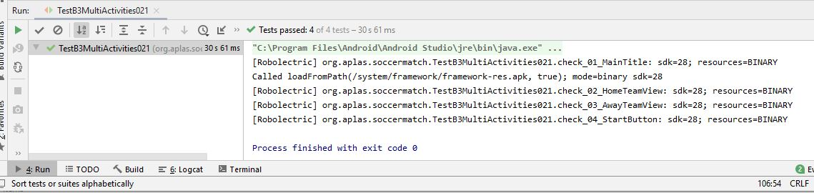

TestB3MultiActivities031
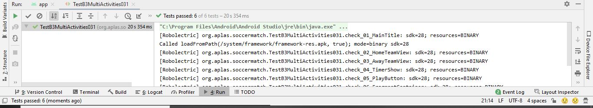

TestB3MultiActivities041
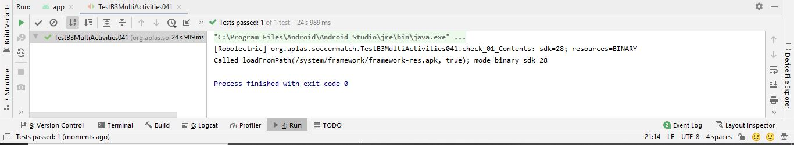

TestB3MultiActivities051
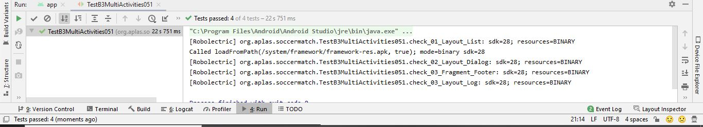

TestB3MultiActivities061
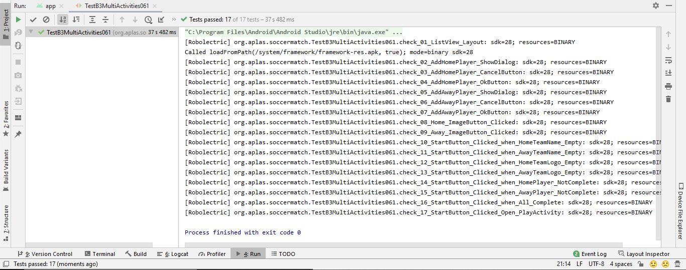

TestB3MultiActivities071 - Failed
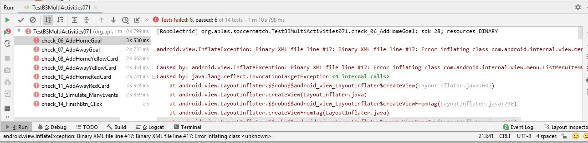

TestB3MultiActivities081 - Failed
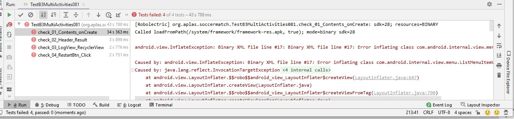

Soccer Match
Halaman Utama
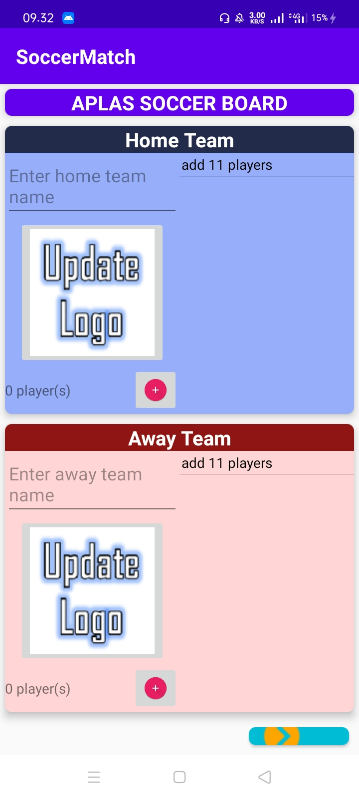

Input nama pemain
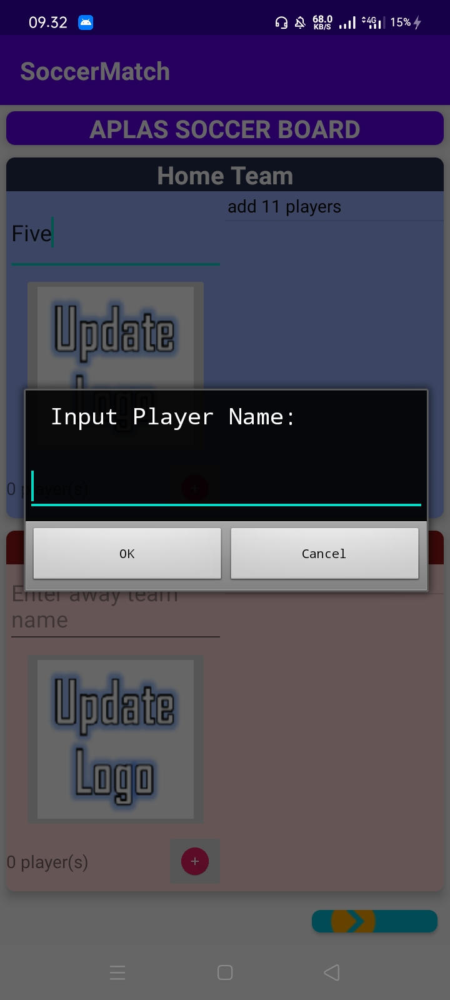

Nama tim, gambar dan nama pemain
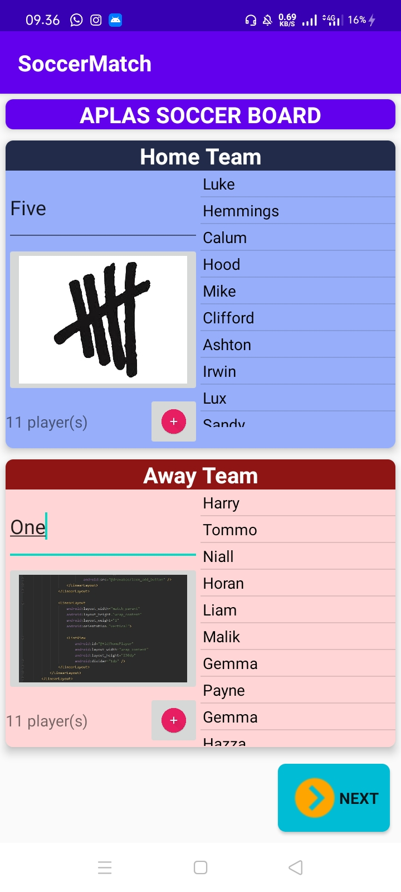

Play
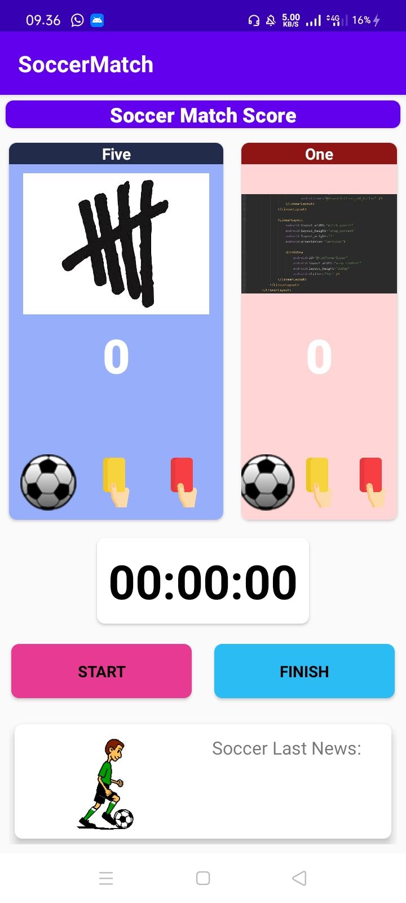

Goal

Red Card
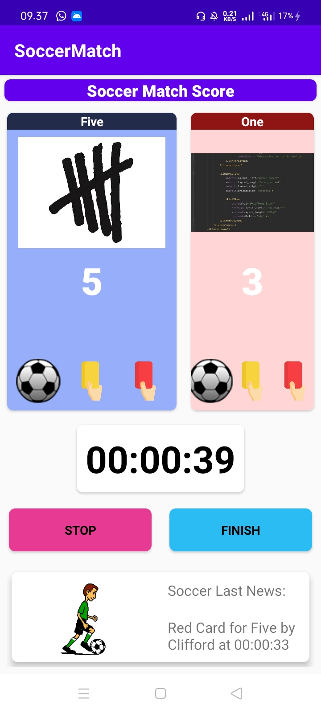

Result
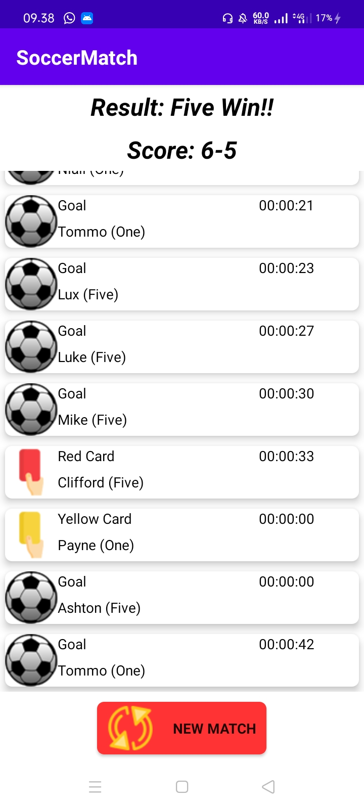