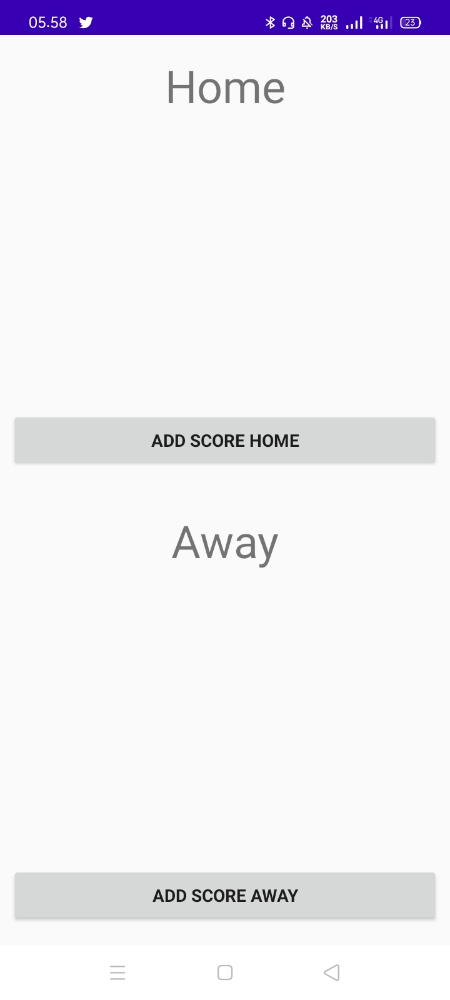
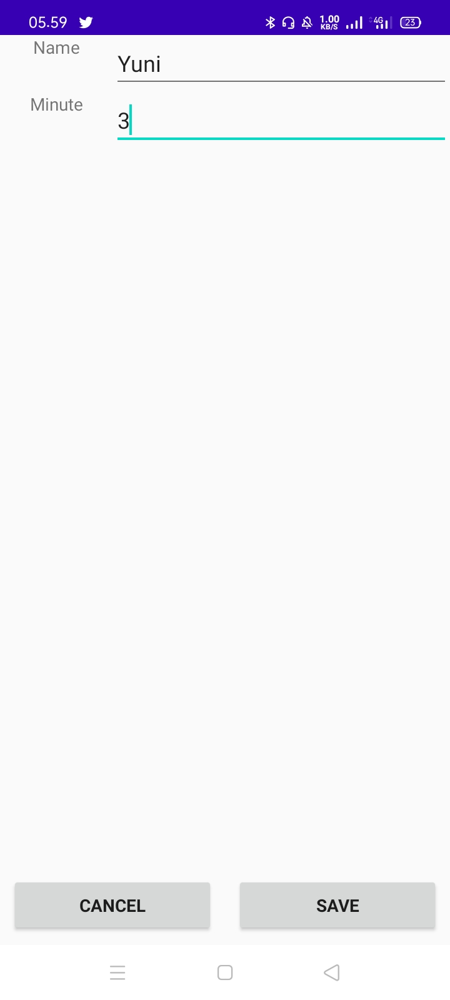
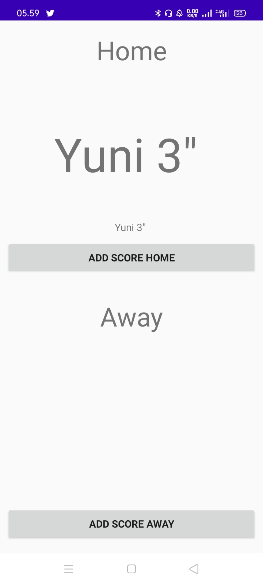
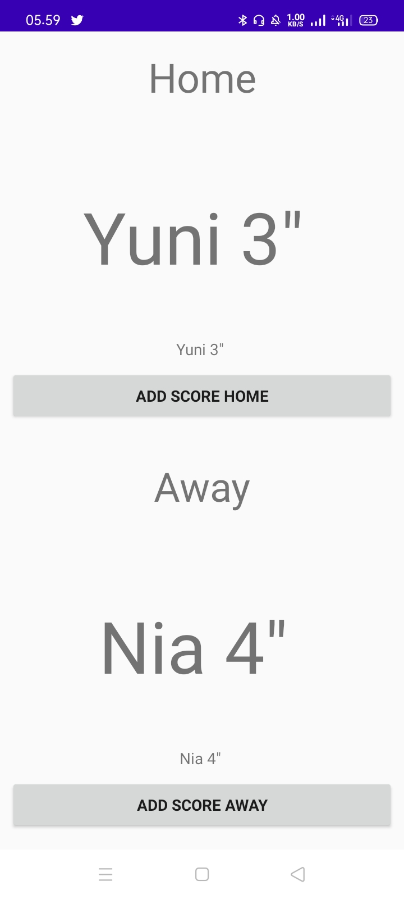

# 09 - Android fundamentals 04.2: Input controls

## Tujuan Pembelajaran

1.  Mahasiswa mengenal tentang arsitektur MVVM.
2.  Mahasiswa memahami lifecycle viewmodel pada MVVM.
3.  Mahasiswa mampu menerapkan viewmodel pada Android.

## Hasil Praktikum

Home - Score View

Input Name and Time

Home Score

Away Score

