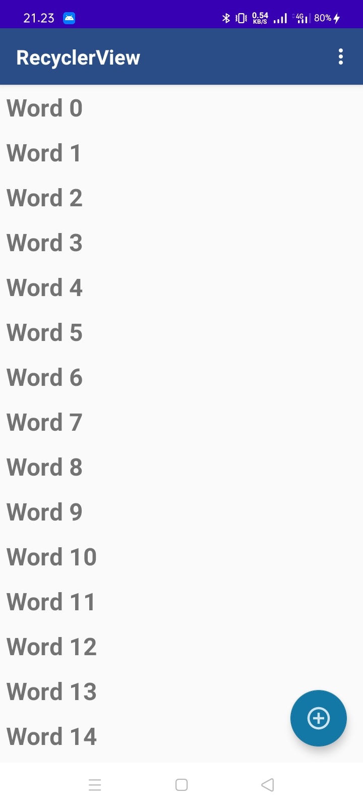
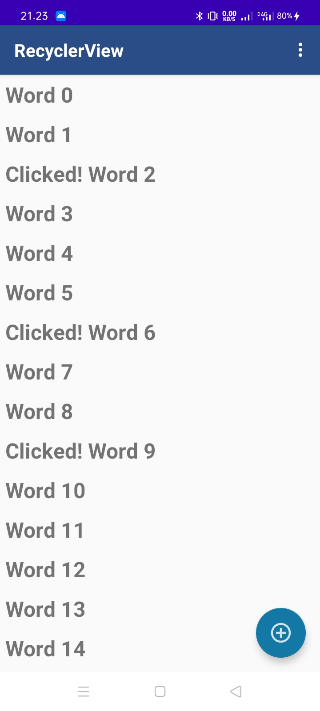
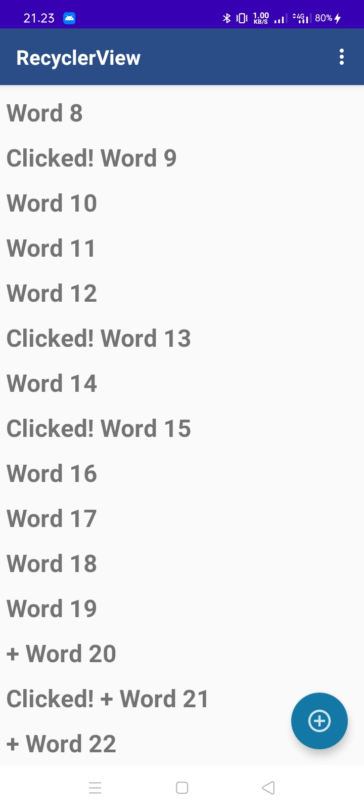
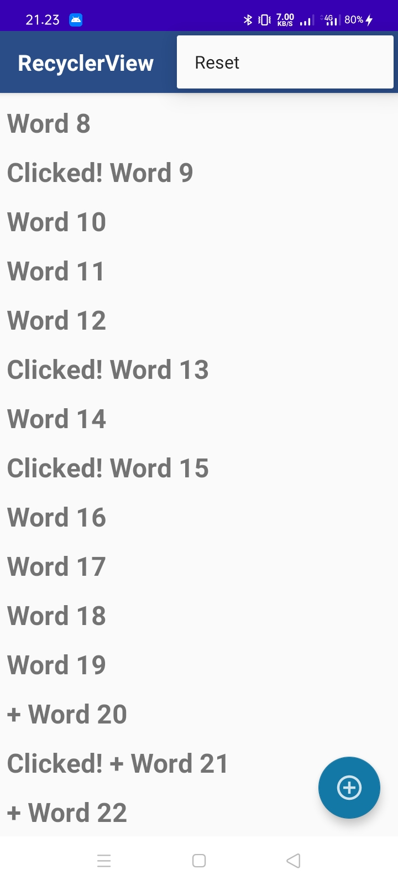
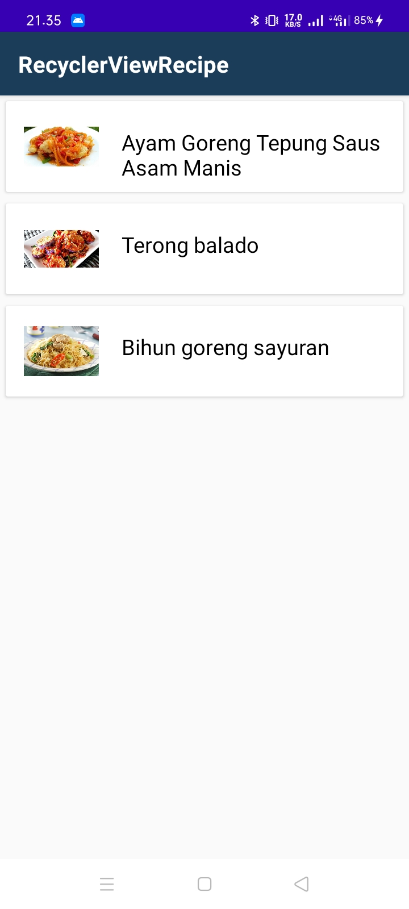
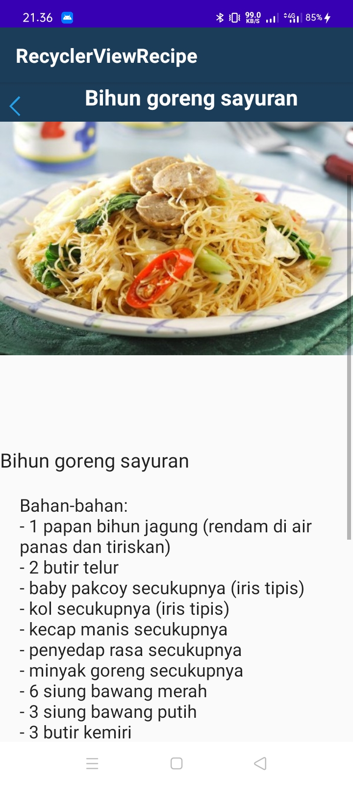

# 09 - ViewModel

## Pendahuluan

Pada praktikum kali ini anda akan mempelajari tahapan-tahapan menambahkan Recycler View pada aplikasi Android, menampilkan data sederhana dengan RecyclerView, menerapkan Recycling ViewHolders, dan menambahkan DataBinding ke Adapter.

## Tujuan Pembelajaran

1.  Mahasiswa mampu menambahkan Recycler View pada aplikasi android;
2.	Mahasiswa mampu menampilkan data sederhana dengan RecyclerView;
3.	Mahasiswa mampu menerapkan Recycling ViewHolders;
4.	Mahasiswa mampu menambahkan Data Binding ke Adapter.

## Hasil Praktikum

Recyclerview

Klik item

Tambah item 

# Challenge
Reset Menu

Setelah di reset, kembali seperti semula

# Homework
Recyclerview Recipe

Recipe Detail

