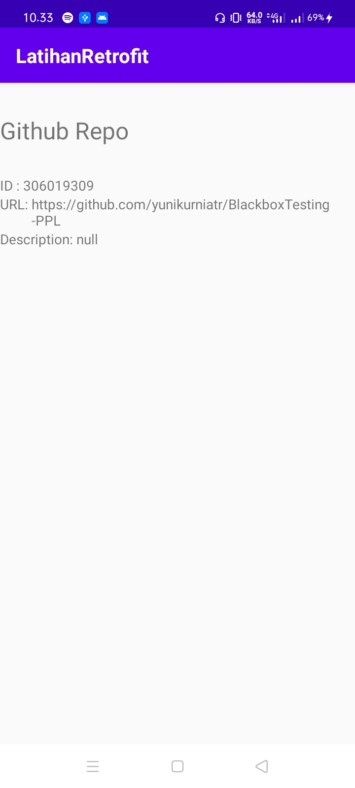
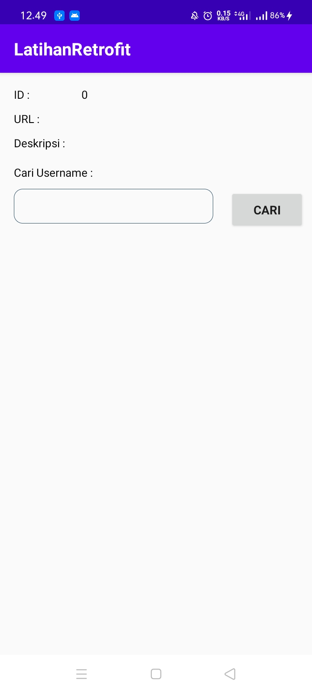
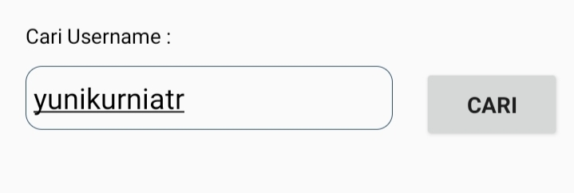
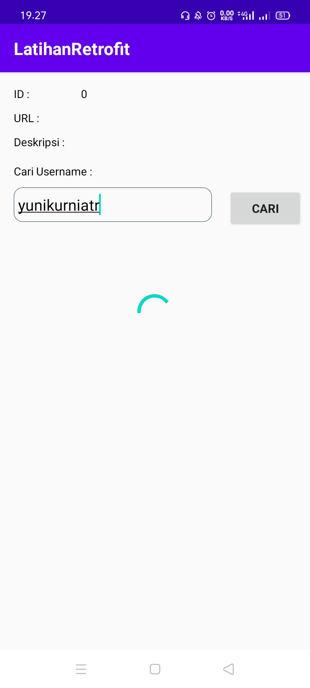
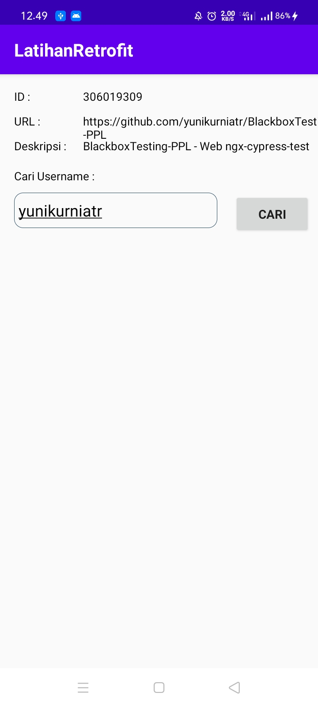

# 12 - Retrofit

## Pendahuluan

Pada praktikum kali ini anda akan mempelajari tahapan-tahapan melakukan request ke RESTful API pada aplikasi Android menggunakan library Retrofit.

## Tujuan Pembelajaran

1. Mahasiswa mampu mengonfigurasi Retrofit pada android;
2. Mahasiswa mampu membuat request ke RESTful API menggunakan Retrofit.

## Hasil Praktikum

Latihan Retrofit

# Challenge

Inputan dari user untuk mengganti username secara dinamis

Tampilan loading atau progress bar 

Hasil

