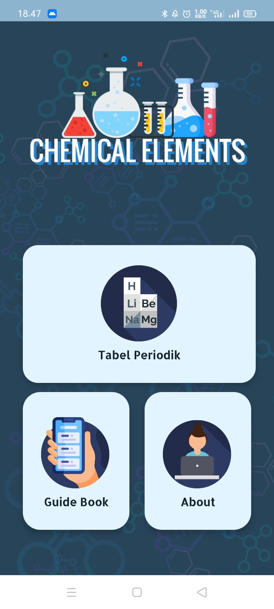
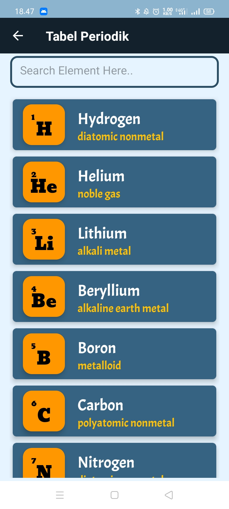
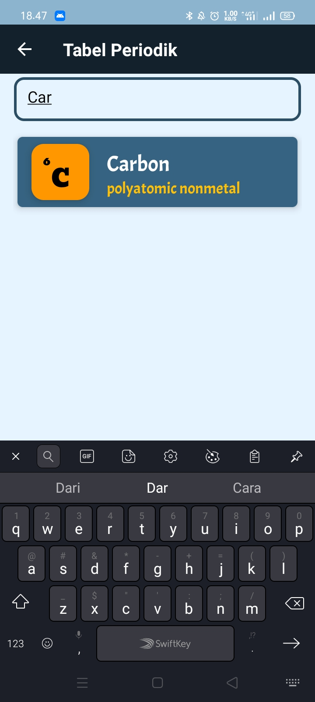
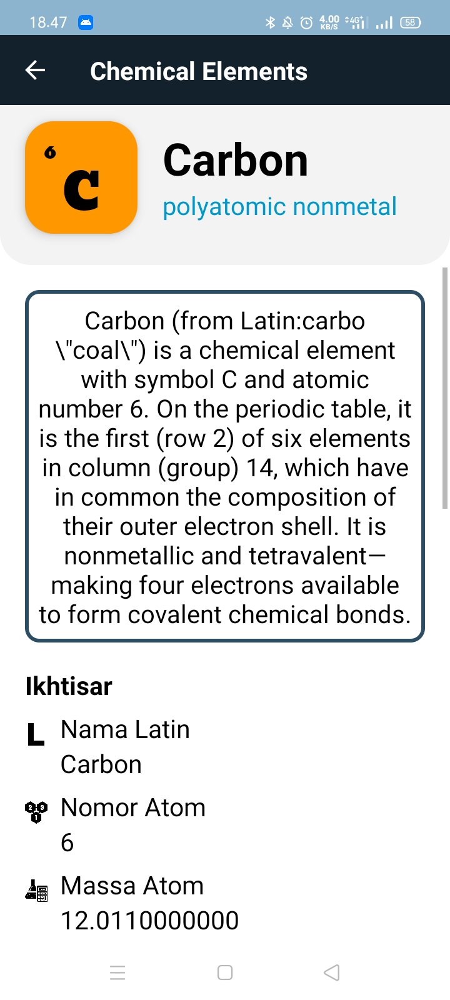
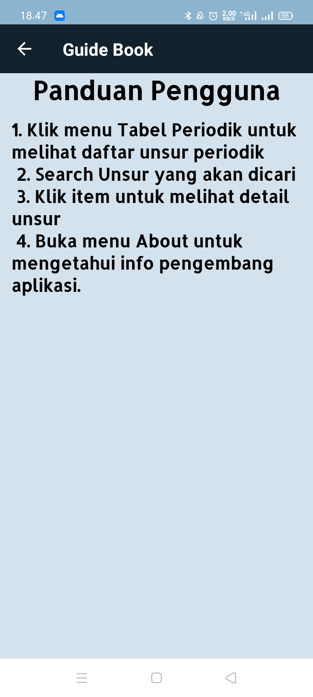
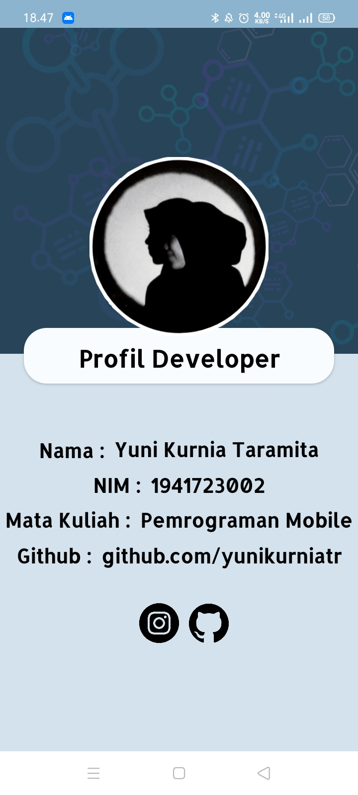

# Laporan Project Akhir (Tugas Besar)

Mata Kuliah : Pemrograman Mobile, Jurusan Teknologi Informasi, Polinema
Dosen Pengampu : Habibie Ed Dien, S.Kom., M.T.
Tahun Ajaran : Semester Ganjil 2020/2021

## Judul / Nama Aplikasi
CHEMICAL ELEMENTS 
Souce code : https://github.com/yunikurniatr/mobile-3d-26/tree/master/src/17_proyek_uas/ChemicalNote
Bahasa Perograman : Java

## Deskripsi Aplikasi
Aplikasi Chemical Elements ini merupakan aplikasi untuk memudahkan dalam belajar unsur kimia dan mendapatkan informasi yang lebih mendalam dari unsur pada Tabel Periodik.

## Indentitas Pengembang (Developer)
NIM : 1941723002
Nama : Yuni Kurnia Taramita
Kelas : TI-3D

## Fitur-fitur Aplikasi
Halaman Home

Tabel Periodik

Search Unsur

Detail Unsur

Guide Book

About

## Saran
Dari proses yang telah dilakukan, disarankan untuk kedepannya pada Aplikasi Chemical Elements ini perlu adanya pengembangan lebih lanjut untuk merancang aplikasi yang lebih baik dan lebih kompleks sesuai dengan kebutuhan. 

## Kesimpulan
Berdasarkan proses yang telah saya lakukan dalam membuat Aplikasi Chemical Elements ini, saya dapat mengimplementasikan materi pembelajaran Pemrograman Mobile yang telah diberikan.

## Sumber Data/Referensi
- Materi pembelajaran Pemrograman Mobile
- Data JSON : https://github.com/Bowserinator/Periodic-Table-JSON/blob/master/PeriodicTableJSON.json
- https://www.simplifiedcoding.net/search-functionality-recyclerview/
- https://nzlpakaya507.wordpress.com/2019/06/28/membuat-dashboard-dengan-gridlayout-dan-cardview-android-studio/
